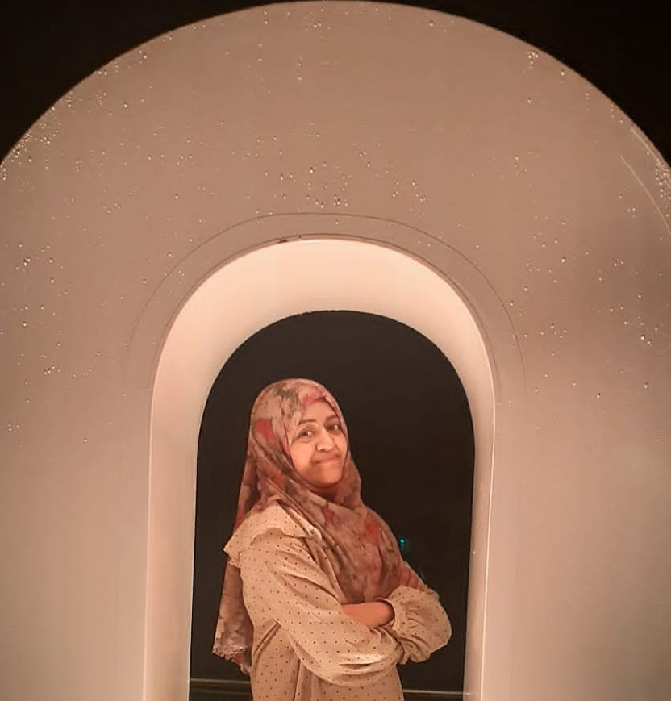

<!DOCTYPE html>
<html lang="en">
<head>
  <meta charset="UTF-8" />
  <meta name="viewport" content="width=device-width, initial-scale=1.0"/>
  <title>Ammazia Hanif</title>
  
</head>
<body>
  

    
    <h1>Ammazia Hanif</h1>
  

  

    <h1>Welcome!</h1>
    
I am currently working as a JSPS Special Research Fellow at the Hitotsubashi University, Tokyo, Japan. I received my Ph.D. in International Public Policy from University of Tsukuba, Japan.
    
My research focuses on health economics, development economics, and partly environmental economics, with a particular interest in the health outcomes of WASH, women’s well-being, and child health in developing countries. My current research projects focus on the health of the women and children in Pakistan, India, Cambodia, Madagascar, and Sub-Saharan Africa.
       

<a href="Ammazia_CV.pdf" target="_blank">CV (PDF)</a>

  Contact: Ammaziahanif409@gmail.com
  

</body>
</html>

---

